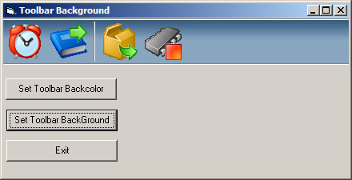



## Toolbar With Background

### Description

Have you ever used the MS Toolbar. and wanted to change the Backcolor or even better set a Background image on it, I know I have anyway few days ago was board and was reading one of my Visual C++ books, and happened to come across an example, so I Got it also to work in VB anyway hope you like it.
 
### More Info
 

             |
---                |---
**Submitted On**   |2006-03-13 01:53:46
**By**             |[dreamvb](https://github.com/Planet-Source-Code/PSCIndex/blob/master/ByAuthor/dreamvb.md)
**Level**          |Beginner
**User Rating**    |4.8 (63 globes from 13 users)
**Compatibility**  |VB 6\.0
**Category**       |[OLE/ COM/ DCOM/ Active\-X](https://github.com/Planet-Source-Code/PSCIndex/blob/master/ByCategory/ole-com-dcom-active-x__1-29.md)
**World**          |[Visual Basic](https://github.com/Planet-Source-Code/PSCIndex/blob/master/ByWorld/visual-basic.md)
**Archive File**   |[Toolbar\_Wi1980223142006\.zip](https://github.com/Planet-Source-Code/dreamvb-toolbar-with-background__1-64669/archive/master.zip)

